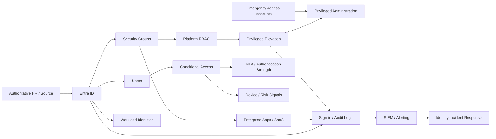

# Enterprise Identity Reference Architecture

A portfolio-safe reference architecture for enterprise identity and access management centered on Microsoft Entra ID concepts: lifecycle automation, SSO, group-based access, RBAC, privileged access, Conditional Access, emergency access, auditability, and incident response.

This repository is intentionally tenant-neutral. It contains no employer configuration, production tenant identifiers, credentials, user data, or customer-specific policy exports.

## What This Project Demonstrates

- Joiner / mover / leaver identity lifecycle design
- SSO and application access patterns
- Group-based authorization
- RBAC and least privilege
- Privileged Identity Management concepts
- Conditional Access design
- MFA and authentication-strength controls
- Break-glass / emergency-access design
- Service principal and workload identity governance
- Access reviews and entitlement governance
- Audit, sign-in, and privileged-operation monitoring
- Identity incident response
- Zero Trust alignment
- Safe configuration assessment from sanitized JSON snapshots

## Reference Architecture



## Design Principles

**Identity is a control plane**  
Compromise of identity can bypass otherwise strong network and application controls.

**Access should be group-based by default**  
Direct user-to-resource assignment increases drift and complicates lifecycle management.

**Privilege should be eligible, time-bound, and auditable**  
Standing administrative access should be minimized.

**Conditional Access is policy, not a single switch**  
Controls should be designed by identity type, resource sensitivity, authentication strength, device posture, location/risk context, and operational exception.

**Emergency access must be independent**  
Break-glass identities should not depend on the same control path they are intended to recover.

**Lifecycle events must remove access as reliably as they grant it**  
Termination and role-change handling are first-class security workflows.

**Workload identities require governance too**  
Service principals, automation identities, secrets, and certificates need ownership, rotation, least privilege, and monitoring.

## Repository Layout

```text
enterprise-identity-reference-architecture/
├── docs/
│   ├── architecture.md
│   ├── identity-lifecycle.md
│   ├── rbac-and-privilege.md
│   ├── conditional-access.md
│   ├── emergency-access.md
│   ├── workload-identities.md
│   ├── audit-and-observability.md
│   ├── incident-response.md
│   ├── zero-trust-mapping.md
│   ├── case-study.md
│   └── adr/
├── examples/
│   ├── tenant-snapshot.example.json
│   ├── access-model.example.json
│   └── lifecycle-workflow.example.yaml
├── scripts/
│   └── Invoke-IdentityArchitectureAssessment.ps1
├── .github/workflows/powershell-ci.yml
├── CONTRIBUTING.md
├── SECURITY.md
├── LICENSE
└── README.md
```

## Safe Assessment Demo

The PowerShell assessment reads a sanitized JSON snapshot rather than connecting to a live tenant.

```powershell
./scripts/Invoke-IdentityArchitectureAssessment.ps1   -Path ./examples/tenant-snapshot.example.json
```

It evaluates example control areas such as:

- privileged accounts without MFA
- excessive standing administrators
- inactive enabled accounts
- emergency-access readiness
- service principals with no owner
- credentials approaching expiration
- direct user assignments that bypass group-based access

The script is designed to demonstrate identity-control reasoning without exposing or modifying a real environment.

## Architecture Deep Dive

- [Architecture](docs/architecture.md)
- [Identity lifecycle](docs/identity-lifecycle.md)
- [RBAC and privilege](docs/rbac-and-privilege.md)
- [Conditional Access](docs/conditional-access.md)
- [Emergency access](docs/emergency-access.md)
- [Workload identities](docs/workload-identities.md)
- [Audit and observability](docs/audit-and-observability.md)
- [Identity incident response](docs/incident-response.md)
- [Zero Trust mapping](docs/zero-trust-mapping.md)
- [Case study](docs/case-study.md)

## Architecture Decisions

- [Group-based access by default](docs/adr/001-group-based-access.md)
- [Eligible privilege over standing privilege](docs/adr/002-eligible-privilege.md)
- [Independent emergency access](docs/adr/003-emergency-access.md)

## Portfolio Boundary

This project is a reference implementation. It does not claim to represent any specific employer's tenant, policies, licensing, or production architecture.
